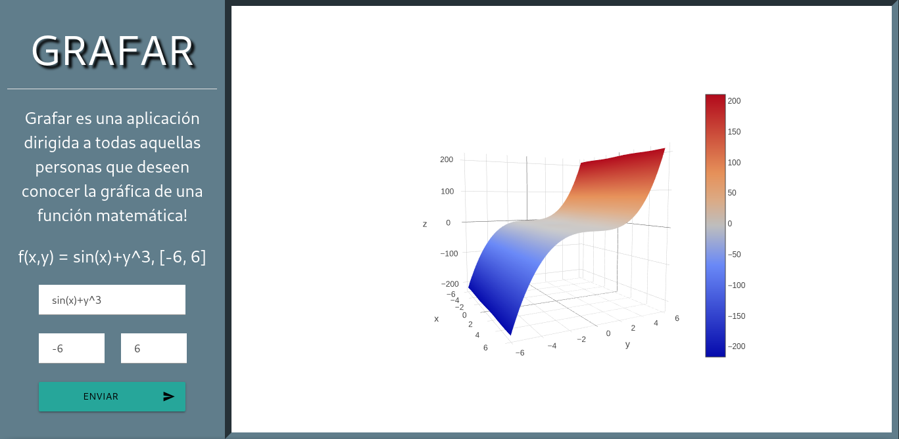
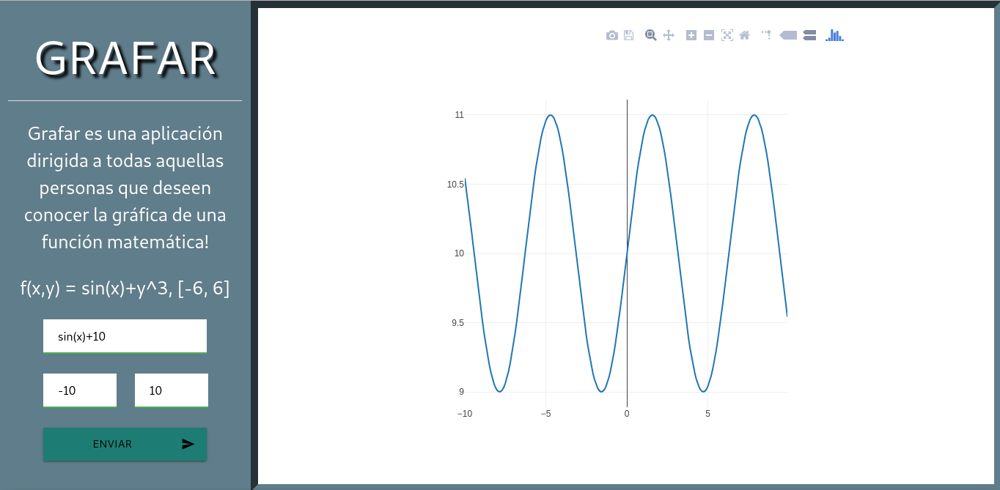

# Grafar

## Descripción
Grafar es una aplicación dirigida a todas aquellas personas que deseen conocer el comportamiento de
la gráfica de una función matemática, bien sea de una o dos variables.
***
## Ejemplos
### Gráficas en 3D

 ### Gráficas en 2D
 
 ***
 ## Funcionamiento
 Para visualizar una gráfica en GRAFAR sólo basta con ingresar los campos solicitados en el formulario, en primer lugar se debe ingresar la función bien sea en términos de x o en términos de x e y, luego se procede a ingresar el intervalo en el cual se desea evaluar la función. 
 ***
 ## Herramientas utilizadas
 * Persistencia
    * MongoDb
 * Backend
    * Python3
    * Python Flask
    * PyMongo
    * Numpy
    * Sympy
* Frontend
    * HTML5
    * CSS3
    * ECMAscript 6
    * jQuery 3.2.1
    * Materialize 1.0.0
    * Plotly 1.41.2
***
## Licencia 

Grafar 1.0.1    
Copyright 2018, Grafar  
All rights reserved.  
Licensed under the GPL license
